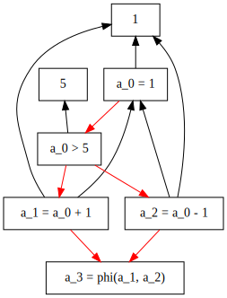
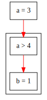
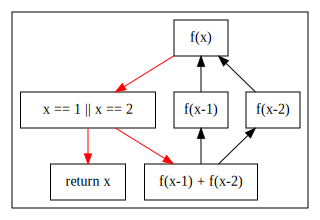

## 简介

这门课将会介绍各类程序结构和组成. 目的是理解程序执行逻辑, 增长视野, 而不是专注于具体哪门语言的语法. 因此, 你应该多思考, 总结, 掌握方法, 举一反三, 这才是这门课预期的学习效果.

同时, 课程的推进决定于个人的练习/实验进度, 作业并非强制性的, 可根据自己的时间自由调节, 不过建议一周内完成一节内容.

1 . [第一节: 变量/类型, 数据流/控制流](#第一节)

2 . [第二节: 表达式/语句/副作用, 函数和递归](#第二节)

## FAQ

说明一些常见问题:

1 . 画图工具?

本文中所有流图都是使用graphviz的dot语言写成的, 比如第一张框图的源码在[这里](https://github.com/xhebox/ioclub/blob/master/src/pages/posts/class/flow_1.dot). 可以自行百度graphviz教程, 或使用其他流程图生成工具. 这里有一个在线查看graphviz代码对应的图片的网站: [webgraphviz](http://www.webgraphviz.com/). 还有很多其他在线查看graphviz代码图片的工具.

2 . python/c语言教学?

这门课不再教授具体的语法, 转而交给学生自学. python/c入门建议阅读[菜鸟教程](https://www.runoob.com/). c语言额外推荐c和指针, c专家编程, c的陷阱和缺陷, krc等书.

编程离不开实践, 不管是python自己的REPL[^REPL], 还是本站浏览器提供的[pyterm](/pyterm)都是绝佳的实验场地. 务必多多实验. 环境搭建可参考[菜鸟教程](https://www.runoob.com/python3/python3-install.html)

[^REPL]: REPL, 即Read Eval Print Loop, 读取-执行-打印循环. 一个可以和你实时交互的编程环境. [python3REPL - 菜鸟教程](https://www.runoob.com/python3/python3-interpreter.html)

3 . 宣讲会上说过的在线运行python?

~~我确实有做, 但线上还有点问题, 一周内修复.~~ 已修复, 请点击导航栏的py3终端.

4 . 课程内容改变?

本页内容是在不断更新的, 具体的改变我会写在[changelog](#changelog)这一节.

5 . 我有问题...?

直接在IO CLUB内部群中询问, 或者发在本站[源码](https://github.com/xhebox/ioclub)的issue上.

## 第一节

这一节分两小节:

1. 变量, 组成程序的基本要素, 类型是变量最重要的部分
2. 数据流和控制流的概念可以帮你进行基本的代码逻辑分析

相关菜鸟教程章节:

+ [c基本语法](https://www.runoob.com/cprogramming/c-basic-syntax.html)
+ [c变量](https://www.runoob.com/cprogramming/c-variables.html)
+ [c常量](https://www.runoob.com/cprogramming/c-constants.html)
+ [c数据类型](https://www.runoob.com/cprogramming/c-data-types.html)
+ [c程序结构](https://www.runoob.com/cprogramming/c-program-structure.html)
+ [c条件控制](https://www.runoob.com/cprogramming/c-decision.html)
+ [c循环](https://www.runoob.com/cprogramming/c-loops.html)
+ [py基础语法](https://www.runoob.com/python3/python3-basic-syntax.html)
+ [py数字](https://www.runoob.com/python3/python3-number.html)
+ [py字符串](https://www.runoob.com/python3/python3-string.html)
+ [py基本数据类型](https://www.runoob.com/python3/python3-data-type.html)
+ [py条件控制](https://www.runoob.com/python3/python3-conditional-statements.html)
+ [py循环](https://www.runoob.com/python3/python3-loop.html)

### 变量(variable)

提问, 你是怎么做心算的? 比如, 你有三个数字$1, 2, 4, \dots$, 求和. 首先你$1 + 2 = 3$, 接着你$3 + 4 = 7$, 以此类推. 仔细反省一下你的计算过程, 这整个过程中你做了三件事情:

1. 把两个数字加起来, 拿到一个结果
2. 把结果暂时记起来, 比如$1 + 2 = 3$的$3$, 以便和后面数字相加
3. 循环往复的进行步骤1-2, 直到所有数字穷尽

你可以通过反省自己的思考过程找到更多类似的例子, 你的思考不外乎以下的步骤:

1. 把某些事物暂时记住
2. 通过某些事物进行一些推断和计算, 可能改变了对现有事物的认识, 还可能记住了一些新的事物
3. 循环往复的进行步骤1-2, 直到你满意为止

对应到程序里, 推断/计算/循环就是各种表达式/语句/操作, 而暂时记起来就对应着变量. 所以程序总的来说, 就是通过变量存储各种**状态**, 并通过其他结构, 如表达式/语句, 对变量进行操作, **改变状态**直到满意为止.

算盘, 也可以算是一种"计算机". 算盘的珠子位置对应着现在计算好的数字, 也就是**状态**, 一个变量, 打算盘就是在加减这个变量, **改变状态**. 而打算盘的这个人就是"程序".

当然, 实际写程序的时候, 程序要是很机械性的: 变量必须有个名字, `int a = 3`, `b = "ggg"`; 这个名字对应这个变量, 或者说这个变量存储的数据/值.

根据编程语言不同, 也有很多其他不同的问题:

+ 变量可能有类型信息, 也可能没有, 详细见下一节. (c语言有类型, py没有类型)

```c
int a = 3; // c
```

```py
a = 3 // python
```

+ **可能**在使用变量之前必须**声明**变量的存在, 没有声明的变量是**不存在**的, 也就是不可使用的. (c语言需要声明, js若使用`var`不需要)

```c
int a; // c
printf("%d\n", a)
```

```js
console.log(a) // js
```

+ **可能**在**声明**变量时必须**定义/初始化**: `int a`声明了变量a的存在, 却没有**定义/初始化**a的值. (c语言声明和定义/初始化是可以分开的, rust要求在声明时必须定义变量的值)

```rust
let a: i32; // rust
println(a) // error: use of possibly unintialized variable: 'a'
```

我列举了一些常见的区别. 你需要自己学习更多的语言来掌握这些常见差别.

### 类型(type)

给出数据34, 求它对应的十进制数字. 答案可以是34, 但也可以是52, 还可以是28. 这三个答案分别对应34是十进制, 十六进制, 八进制时, 对应的十进制大小. 因此一个数据可以有不同解释, 如果附加条件不同的话.

在编程语言中也有类似情况, 根据类型不同, 数据可以有两种解释. 编程语言按类型可以分为两种: 强类型, 弱类型.

```c
int c = 1;
char string[] = "hello";
```

这是c语言中的变量定义, 每个变量都有具体的类型, 比如c的类型是`int`, `string`的类型是`char*`, 所以是强类型语言. 强类型语言不存储变量信息, 即c语言并不关心底层存储的是什么数据. 恰恰相反, c语言会把底层的数据解释成你给予的类型. 举个例子:

```c
int c = 1;
char *string = (char*)(&c);
```

通过强制类型转换`char*`, `string`这个字符串变量指向了变量c, 也就是指向了1. 但是打印[`printf("%s", string)`]结果并不是1, 因为`string`是个字符串变量. 所以它会把1对应的二进制数据`0x00000001`解释为一个字符串. 按字符串解释方法, 每两个十六进制数, 即每byte对应一个字符, `0x00`是字符串的终止符, `0x01`是不可打印的控制字符. 所以不管怎么样, 结果中都不可能出现1.

```py
c = 1
string = 'hello'
```

这是py语言中的变量定义, 除了名字初始值什么都没有, 所以是弱类型语言. 弱类型语言并非没有类型, 而是把类型信息通过某种方式隐藏, 你看不到, 也不需要看到. 程序自动检查类型信息, 遇到数字就输出数字, 遇到字符串就输出字符串. 一般来说, 类型信息是紧跟这变量存储的.

这两类语言共同点是, 不管是哪种语言, 都是通过类型信息来解释底层的二进制数据. 区别只在于什么时候获取类型, 怎么获取类型.

### 数据流(data flow)/控制流(control flow)

注意: **本节假定你有基本编程基础, 若不了解, 可跳过本节, 继续阅读下一节, 学会基本的编程语句后, 再重新阅读本节**

程序结构只关心两点: 数据/变量怎样变动, 控制/步骤怎么进行. 接下来会展示数据流和控制流的图例, 目的是真正明白程序的执行逻辑. 数据流和控制流是两个抽象概念, 和具体的程序执行环境无关, 是分析的工具.

下图以一个简单c语言程序展示:

```c
int a = 1;
if (a > 5)
	a = a + 1;
else
	a = a - 1;
```



我们用红色箭头标识控制的传递, 黑色箭头表示数据的流动. 数据的流动是指各个常量, 变量从哪一个存储空间, 转移到了另一个存储空间; 而控制的传递是指, 什么时候应该根据什么条件执行什么操作, 执行完成后应该接着执行哪个控制逻辑.

注意, 执行流是从上到下的红色箭头, 数据流是从下到上的黑色箭头. 以上图为例, 程序首先从最顶部`a_0 = 1`开始, 对应源程序`a = 1`.

通过红色箭头, 传递控制到分支`a_0 > 5`, 对应源程序`if (a > 5)`. 需要a的数据和5的数据进行比较, 所以有从下倒上指向5黑色箭头, 指向`a_0 = 1`的双向红色箭头.

源程序中, 当`a > 5`时, 才会去执行`a = a + 1`, 反之执行`a = a - 1`. 对应到图中, `a_0 > 5`时, 从红色箭头指向`a_1 = a_0 + 1`这一支走, 否则从`a_2 = a_0 + 1`这一支走.

最后两个分支都通过红色箭头, 传递控制到`a_3 = phi(a_1, a_2)`. 这是属于SSA[^ssa]形式的`phi()`函数. 通俗的讲, 当程序的控制从`a_1 = a_0 + 1`传递到`a_3 = phi(a_1, a_2)`时, `a_3 = a_1`; 当程序的控制从`a_2 = a_0 - 1`传递到`a_3 = phi(a_1, a_2)`时, `a_3 = a_2`.

[^ssa]: [静态单一赋值](https://zhuanlan.zhihu.com/p/57787118), [SSA - wikipedia](https://en.wikipedia.org/wiki/Static_single_assignment_form), 两个参考

下面拆分本图, 分开介绍不同的组成元素.

#### 赋值(assignment) & 表达式(expression)

```c
a = 3 + 4;
```


将一个常量, 变量从一个地方, 转储到另一个地方. 用黑色箭头, 从起始指向目的.


为简化作图, 突出重点, 表达式计算, 比如`3 + 4`这类四则运算, 可以合并到一个区块内. 同理, 其他区块, 也有类似简写标记, 逻辑清晰即可, 不作强制要求.

#### 跳转(jump)

```c
a = 3;
a = a + 1;
```


跳转, 是控制转移的另一种说法: 从一个控制逻辑, 跳转到另一个控制逻辑; 从一条指令, 跳转到下一条指令; 从这一行代码, 跳转到下一行代码. 当然跳转不只可以是从这一行到下一行, 还可以跳转七八行(c语言中的`goto`).

为统一, 全部使用红色箭头, 从当前指令, 指向下一条要执行指令.

#### 分支(branch)

```c
switch (a) {
case 1:
	b = 1;
	break;
case 2:
	b = 2;
	break;
case 3:
	b = 3;
	break;
// more branches
}
```


分支不外乎接受n个参数, 计算后跳转到m不同指令. 比如c语言中的`if (cond)`, 就是接受`cond`表达式, 或者`cond`变量, 进入本分支, 或另一个分支. 而上图给出了, c语言中switch分支例子.

#### 代码块(block)

```c
a = 3;
if (a > 4) {
	b = 1;
	c = 2;
}
```



我们也经常把相关的逻辑划分到一块, 对应到图中就是, 将相关部分用大方块括起来. 你可以上图的方块当成一个函数:

```c
void f(int a) {
	if (a > 4) {
		b = 1;
		c = 2;
	}
}
```

当然, b和c在这种情况下是全局变量. 我们说跳转到一个区块的时候, 其实是跳转区块第一行代码, 所以规定一个区块必须有一个起始点: `entry`. 见下一节循环的例子.

#### 循环

```c
b = 3
while (a > 4)
	a--;
b = 4;
```


用图例表示一个while循环, `b=3`是程序开始执行起点, `entry`是循环区块的起点. 只要`a > 4`, 此分支就跳转到`a--`, 否则跳转到`b=4`. 你可能注意到, 这张图中我并没有写类似`a_0`, `a_1`这样的变量名称, 这也是SSA[^ssa]形式的一部分. 但SSA难以快速理解, 所以只留一道hard的思考/练习题. 现实中SSA的图例可以参照libfirm[^libfirm].

[^libfirm]: [libfirm](https://pp.ipd.kit.edu/firm/GraphSnippets.html)

### 练习

1 . (easy) 画出下列程序的框图:

```c
int a = 3;
int b = 5;
if (b < 6) {
	b = 4
	a = a + b
}
```

要求使用代码块框起`{}`包围的部分.

2 . (easy) 画出下列程序的框图:

```c
int b = 0;
for (int i=0;i<10;i++)
	b++;
```

3 . (easy) 编程中的函数是什么东西? 你能画出下列函数的框图吗?

```c
void f1(int a) {
	a = a + 1;
}

void f2(int a, int b) {
	a = a + b;
}

int f3(int a, int b) {
	return a + b;
}
```

4 . (easy) 你能把1, 2题中的c程序, 改写成python程序吗?

5 . (normal) 画出下列程序的框图:

```c
int b = 0;
for (int i=0;i<10;i++) {
	b++;
	if (b > 5)
		break;
}
```

6 . (normal) 能把3, 5题中的c程序, 改写成python程序吗?

7 . (normal) 下列程序运行结果是什么?

```c
#include <stdint.h>
#include <stdio.h>

int main() {
	uint16_t a = 0x0102;
	printf("%d", (uint8_t)a);
	return 0;
}
```

是0x0102, 0x02, 0x01, 还是0x0201? 为什么?

提示: 尝试结合数据和解释一节, uint16_t为16bits, uint8_t为8bits

8 . (normal) 什么是递归, 你能写出一个递归函数吗?

9 . (hard) 什么是SSA形式, 有什么用(简要理解概念即可)?

10 . (hard) 你能画出下面程序的SSA形式框图吗:

```c
a = 5
while (a > 0)
	a--;
a = 4;
```

## 第二节

这一节分两小节:

1. 表达式/语句/副作用, 组成程序的基本要素
2. 函数, 组成程序的基本要素, 递归是函数的一个大用处

相关菜鸟教程章节:

+ [c基本语法](https://www.runoob.com/cprogramming/c-basic-syntax.html)
+ [c条件控制](https://www.runoob.com/cprogramming/c-decision.html)
+ [c循环](https://www.runoob.com/cprogramming/c-loops.html)
+ [c递归](https://www.runoob.com/cprogramming/c-recursion.html)
+ [py基础语法](https://www.runoob.com/python3/python3-basic-syntax.html)
+ [py条件控制](https://www.runoob.com/python3/python3-conditional-statements.html)
+ [py循环](https://www.runoob.com/python3/python3-loop.html)

### 表达式(expression)/语句(statement)

编程语言一般会把操作分为两类: 表达式, 语句. 写法都类似于数学公式. 区别在于:

1. 表达式会给出一个值, **可能有副作用**, 它的目的是结合/计算多个变量
2. 语句主要处理除计算外的一些操作, **可能会运算成值/有副作用**, 末尾可能跟有`;`这种终止符

还有一些两者都是的东西: 函数调用既可以是表达式, 也能作语句. 这两者大多时候是高度交叉的, 不需要纠结二选其一这样的问题. 我们更关心的是他们在程序执行时候的差别.

一般来说, 表达式是由变量和运算符(`+/-/*/%`之类的)组成的, 类似`(a+b) * 4`. 运算符可以分为:

1. `a++`, `--a`, 一元运算符, 也就是只作用于一个变量, 可进一步根据运算符和变量之间的位置细分为前缀`++a`/后缀`a--`
2. `a + b`, 二元运算符, 作用于两个变量, 最常用的一些
3. `a ? b : c`, 三元运算符, 作用于三个变量

表达式有**结合顺序**[^coperator]的问题: `i+++2` 到底是`(i++)+2`还是`i+(++2)`? 或者说它是从左往右结合, 还是从右往左结合? 先结合`++`运算符, 还是先结合`+`运算符?

[^coperator]: [c运算符优先级](https://en.cppreference.com/w/c/language/operator_precedence)

这得具体语言具体分析, 对于c来说, 这是`(i++)+2`. 结合顺序可以通过`()`来解决, 这也是推荐的方法: 干脆就不要写让人迷惑的表达式, 直接写`(i++) + 2`不就好了.

但同时, 表达式也有**求值顺序**[^csequence]的问题:

[^csequence]: [c求值顺序规则](https://en.cppreference.com/w/c/language/eval_order)

```c
i = 3;
i = i++ + 1;
```

最后i的值, 到底是`i++`之后的3, 还是多加1之后的4? 答案是**未定义**[^cundefined]. c语言通过**序列点(sequence point)**来规范求值顺序和结果. c++也继承了c的规范, 不过c++17标准之后大有改动, `i = i++ + 1`在c++17之后并不是未定义行为.

[^cundefined]: [c未定义行为](https://en.cppreference.com/w/c/language/behavior)

而**语句**, 本质上是对"过程"的一种抽象. 第一节讲变量时说过, 你做的操作就是: 计算结果, 并判断, 直到满意. 语句实际上就是除加减乘除, 这些有代数特色的运算以外, 其他所有操作的抽象.

所以, `if`不属于表达式, `while`也不属于, `for`也不属于, 这些都是不同于"计算"的其他操作, 这基本上对应着控制流, 而表达式基本上对应着数据流.

### 副作用(side effect)

c语言典型的语句是`c = 3;`赋值语句. 但赋值在c语言中其实是一个表达式: `(c = 3) == 3`. `c = 3;`被判定成语句的原因是末尾的`;`. 很多语言, 表达式加一个终止符`;`, 或者换行后, 就变成了一条语句.

上一节说过`(c = 3) == 3`这样的表达式, 目的是计算并返回一个值, 但是本例中, 它也完成了一个变量的赋值, 这次赋值是表达式的**副作用(side effect)**. 还有一类常见副作用是IO操作, `printf("xx")`有返回值, 但你甚至可能从来都没用过. 它的主要作用, 打印到屏幕上, 其实是它的副作用.

**但是, 副作用并非必要**. 副作用几乎可以说是 **命令式编程(imperative programming)** 的特产. 有很多不同的方法可以抽象计算外的其他操作: 虽然大家都用语句抽象, 但可以用不同的方式去抽象. 比如, Haskell这个 **函数式编程(functional programming)** 语言中的**Monad**[^monad]. 或者SQL这种典型的 **声明式编程(declarative programming)** .

[^monad]: [haskell IO](https://www.jianshu.com/p/7f715d4695ee)

### 函数(function)/递归(recursion)

函数是接受输入, 给定输出的一个过程:

```py
def add(x, y):
	return x + y
```

最初的目的是提取经常重复写的代码, 为它起个名字, 这样不用一遍一遍写. 第一节控制流小节说的代码块可以看成函数, 就是这个意思. 如果你把一个代码块提出来, 起个名字, 那其实就和函数一样了. 函数后来进一步拓展出**作用域**, **形参/实参**, **递归**等衍生话题.

大多语言只允许返回一个返回值, 有些语言(go语言)允许返回多个返回值. 到这里, 函数已经完全不像原本的数学中的函数的定义了, 务必不要拿数学的函数来理解程序的函数.

这一节主要讲递归:

```py
def sum(x):
	if x == 1:
		return 1
	return sum(x - 1) + x
```

你不要知道栈, 就能理解递归. 假设函数:

$$
sum(x) = \sum _ {i=1}^x i
$$

可得

$$
sum(x) = \sum _ {i=1}^{x-1} i + x
= sum(x-1) + x \quad x > 1
$$

这是对应的数学表示, 第二个递推式只在$x > 1$时成立. 现在来看看它对应的程序框图:


这个框图$x \neq 1$的时候, 完美的反应了递推式. 递推式只有在$x > 1$时成立, 因此, 我们在x减少到$x = 1$时, 不再使用递推关系, 而是直接返回$1$. 因为$sum(1) = 1$.

可以说递归的核心就是:

1. 大问题化小问题
2. 通过递归调用解决小问题
3. 额外几步计算, 通过小问题的答案给出大问题的答案

而递推就是一个典型的可以这么做的情况. 动态规划这类算法问题就常写出递推公式, 所以动态规划的问题可以用递归解决.

至于为什么可以这样写, 递归的时候数据是怎么流动的, 之后几节再说. 现在来看看斐波那契的例子:

```py
def fib(x):
	if x == 1 or x == 2:
		return 1
	return fib(x-1) + fib(x-2)
```

对应的递推公式:

$$
f(1) = 1
\\
f(2) = 1
\\
f(x) = f(x-1) + f(x-2) \quad x > 2
$$

有n级楼梯, 可以1次跨一级台阶, 或1次二级台阶, 有多少种爬法? 对应的递推公式:

$$
f(1) = 1
\\
f(2) = 1 + 1 = 2
\\
f(n) = f(n-1) + f(n-2)
$$

你可以看到这个公式就是fibnacci.

这个问题可以到着来思考, 假设你已经站在第n级. 爬楼梯要么一级, 要么两级, 所以要么是从n-1级迈一步到n级, 要么是直接从n-2跨两级到n级.

所以从n-1到n只有一种爬法, n-2级到n级只有一种爬法. 假设你已经知道, n-1级的爬法次数, 还有n-2级的爬法次数, 相加即得到n级的爬法次数.

你可能会说n-2到n级, 还可以迈两次两个一级, 那种情况迈一级之后就变成n-1到n级的情况, 已经重叠了, 所以不需要重复考虑.

### 练习

1 . (easy) 本节中的爬楼梯, 写出代码, 画出程序框图

有n级楼梯, 可以1次跨一级台阶, 或1次二级台阶, 有多少种爬法?

**答案**:

此处有[leetcode 原题](https://leetcode-cn.com/problems/climbing-stairs/)

c写法:

```c
int f(int n) {
	if (n == 1 || n == 2) return n;
	return f(n-1) + f(n-2);
}

printf("res = %d\n", f(3));
// res = 3
```

py写法:

```python
def f(n):
	if n == 1 or n == 2:
		return n
	return f(n-1) + f(n-2)

print("res = ", f(3));
# res = 3
```

框图:



2 . (easy) 阶乘$f(x) = x!$, 写出代码

递推式:

$$
f(1) = 1
\\
f(x) = f(x-1) * x \quad x > 1
$$

c写法:

```c
int f(int n) {
	if (n == 1) return n;
	return f(n-1) * n;
}

printf("res = %d\n", f(3));
// res = 6
```

py写法:

```python
def f(n):
	if n == 1:
		return 1
	return f(n-1) * n

print("res = ", f(3))
# res = 6
```

3 . (easy) 有n级楼梯, 可以1次跨一级,二级,三级台阶, 有多少种爬法? 求代码

递推式:

$$
f(1) = 1
\\
f(2) = 2
\\
f(3) = 4
\\
f(x) = f(x-1) + f(x-2) + f(x-3) \quad x > 3
$$

跨一级只有一种走法, 跨两级有$1+1$和$2$两种走法. 跨三级: $1+1+1$, $1+2$, $2+1$, $3$.

c写法:

```c
int f(int n) {
	if (n == 1) return 1;
	if (n == 2) return 2;
	if (n == 3) return 4;
	return f(n-1) + f(n-2) + f(n-3);
}

printf("res = %d\n", f(4));
// res = 7
```

py写法:

```python
def f(n):
	if n == 1:
		return 1
	if n == 2:
		return 2
	if n == 3:
		return 4
	return f(n-1) + f(n-2) + f(n-3)

print("res = ", f(4))
# res = 7
```

4 . (easy) 有n级楼梯, 可以1次跨一级,三级台阶, 有多少种爬法? 写出代码

递推式:

$$
f(1) = 1
\\
f(2) = 1
\\
f(3) = 2
\\
f(x) = f(x-1) + f(x-3) \quad x > 3
$$

跨一级只有一种走法, 跨两级: $1+1$, 跨三级: $1+1+1$, $3$.

c写法:

```c
int f(int n) {
	if (n == 1 || n == 2) return 1;
	if (n == 3) return 2;
	return f(n-1) + f(n-3);
}

printf("res = %d\n", f(4));
// res = 3
```

py写法:

```python
def f(n):
	if n == 1 or n == 2:
		return 1
	if n == 3:
		return 2
	return f(n-1) + f(n-3)

print("res = ", f(4))
# res = 3
```

5 . (normal) 求杨辉三角, 第m行, 第n个数字(m/n从0开始)? 写出代码

递推式, 杨辉三角的某个数等于上一行左右两个数之和:

$$
f(m, n) = 1 \text{ if } n = 0
\\
f(m, n) = 1 \text{ if } m = n
\\
f(m, n) = f(m-1, n-1) + f(m-1, n) \text{ if }  n > 0 \cap m > 0
$$

c写法:

```c
int f(int m, int n) {
	if (n == 0 || m == n) return 1;
	return f(m-1, n-1) + f(m-1, n);
}

printf("res = %d\n", f(4, 3)); // 第五行第四个
// res = 4
```

py写法:

```c
def f(m, n):
	if n == 0 or m == n:
		return 1
	return f(m-1, n-1) + f(m-1, n)

print("res = ", f(4, 3))
" res = 4
```

6 . (normal) 从n个球中取出m个$C_n^m$，一共有多少可能性? 写出代码

递推式:

$$
C_n^m = 1 \text { if } n = m
\\
C_n^m = \frac{n!}{m!(n-m)!}
\\
= \frac{(n-1)!}{m!(n-1-m)!} \times \frac{n}{n-m}
\\
= C _ {n-1}^m \times \frac{n}{n-m} \text{ if } n-1 \geq m
$$

c写法:

```c
int f(int n, int m) {
	if (n == m) return 1;
	return f(n-1, m) * n / (n-m);
}

printf("res = %d\n", f(4, 3));
// res = 4
```

py写法:

```python
def f(n, m):
	if n == m:
		return 1
	return f(n-1, m) * n / (n-m)

print("res = ", f(4, 3))
" res = 4.0
```

7 . (normal) 汉诺塔最少移动次数, 写出代码

三个柱子：A, B, C. A柱子上有n个环，将n个环全部移动到C上最少移动次数. (大环不能放在小环上, A柱子上的环符合本要求)

**答案**:

一个环可直接移动.

两个环需要先将小的从A移动到B上, 大的从A移动到C上, 最后小的从B到C, 一共3次.

考虑有3个环, 我们需要先将前两个从A移动到B, 第三个从A移动到C上, 最后前两个从B到C, 一共$3 + 1 + 3 = 7$次. 这其中, 前两个从A移动到B, 从B移动到C的过程, 和两个环A移动到C的步骤是高度相似的.

考虑n个环, 将前n-1个从A移动到B, 第n个从A移动到C, 最后前n-1个B移动到C. 如果忽略第n个环, 你可以认识到将n-1个环从A移动到B, 从B移动到C的过程是一样的, 只是起始柱子, 目的柱子, 用来临时放环的空闲柱子不同而已.

因此, 可以得出递推式:

$$
f(1) = 1
\\
f(n) = f(n-1) * 2 + 1 \text{ if } n > 1
$$

为什么是最少呢? 因为若想将第n个环挪到C上, 第n个环上必然没有其他环, 且C上也没有其他环(第n个环是最大的). 所以要想实现这个过程, 必定需要将前n-1个环挪动到B上, 才能开始挪动第n个环, 而挪动第n个环后, 也只剩挪动前n-1个环到C上一种操作. 因此, 操作方法是唯一的(排除你一直小环来回挪不做正事的可能性), 所以也一定是最少的.

c写法:

```c
int f(int n) {
	if (n == 1) return 1;
	return f(n-1) * 2 + 1;
}

printf("res = %d\n", f(4));
// res = 15
```

py写法:

```python
def f(n):
	if n == 1:
		return 1
	return f(n-1) * 2 + 1

print("res = ", f(4))
" res = 15
```

8 . (hard) 爬楼梯的递归代码中存在重复计算吗? 可以在仍然使用递归的方法下避免重复计算吗? 若可以, 给出代码

存在, 可以避免.

c写法:

```c
int computed[1024] = {1, 2, 0};

int f(int n) {
	if (computed[n] != 0) return computed[n];
	int r = f(n-1) + f(n-2);
	computed[n] = r;
	return r;
}

printf("res = %d\n", f(3));
// res = 3
```

9 . (hard) 下面的c语言代码是不是未定义行为? 为什么

```c
int a[3] = {1, 2, 3};
int i = 1;
a[i++] = i;
```

**答案**:

是. 根据c语言标准, `a[i++] = i;`只有两个序列点, 赋值`=`和`;`. 赋值后直接通过`;`结束语句, 这两个序列点之间没有其他操作, 所以不存在问题(`a=3,c=4;`这样写就有其他操作了).

在向数组赋值前, 需要计算`i++`和`i`的值, 但因为赋值前没有其他序列点, 所以`i++`和`i`的求值顺序不确定先后, 而且本行为未定义.

这行代码可能执行为`a[2] = 1`, 也可能是`a[1] = 2`, 或者直接让你的电脑死机, 这都是执行预期内的行为.

10 . (hard) 补完下列c程序:

```c
int sum(int a) {
	// 写出代码
}
```

函数接受参数a, 返回结果$sum(a) = \sum_{i=1}^a i$, 只许使用递归, 变量, `&&`, `||`, `==`, `=`, `+`, `-`.

提示: 试画出`&&`和`||`的程序框图.

**答案**:

```c
int sum(int a) {
	int r = 1;
	a == 1 || (r = sum(a-1) + a);
	return r;
}
```

## changelog

+ 第一节润色完成, 新增变量小节
+ 第二节内容完成, 已添加
+ 更改练习难度为easy, normal, hard, 调整一二节练习
+ 第二节答案放出
+ 标注需要阅读的菜鸟教程章节
