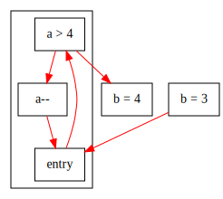

## 简介

这门课将会介绍各类程序结构和组成. 目的是理解程序执行逻辑, 增长视野, 而不是专注于具体哪门语言的语法. 因此, 你应该多思考, 总结, 掌握方法, 举一反三, 这才是这门课预期的学习效果.

同时, 课程的推进决定于个人的练习/实验进度, 作业并非强制性的, 可根据自己的时间自由调节, 不过建议一周内完成一节内容.

1 . [第一节: 类型, 数据流, 控制流](#第一节)

2 . [第二节: 表达式, 函数, 递归](#第二节)

## FAQ

说明一些常见问题:

1 . 画图工具?

本文中所有流图都是使用graphviz的dot语言写成的, 比如第一张框图的源码在[这里](https://github.com/xhebox/ioclub/blob/master/src/pages/posts/class/flow_1.dot). 可以自行百度graphviz教程, 或使用其他流程图生成工具. 这里有一个在线查看graphviz代码对应的图片的网站: [webgraphviz](http://www.webgraphviz.com/). 还有很多其他在线查看graphviz代码图片的工具.

2 . python/c语言教学?

这门课不再教授具体的语法, 转而交给学生自学. python/c入门建议阅读[菜鸟教程](https://www.runoob.com/). c语言额外推荐c和指针, c专家编程, c的陷阱和缺陷, krc等书.

编程离不开实践, 不管是python自己的REPL[^REPL], 还是本站浏览器提供的[pyterm](/pyterm)都是绝佳的实验场地. 务必多多实验.

[^REPL]: REPL, 即Read Eval Print Loop, 读取-执行-打印循环. 一个可以和你实时交互的编程环境.

3 . 宣讲会上说过的在线运行python?

我确实有做, 但线上还有点问题, 一周内修复.

4 . 我有问题...?

直接在IO CLUB内部群中询问, 或者发在本站[源码](https://github.com/xhebox/ioclub)的issue上.

## 第一节

这一节主要覆盖类型, 以及数据流和控制流的内容. 类型是一门编程语言最重要的部分之一. 而数据流和控制流的概念可以帮你掌握基本的代码逻辑分析技能.

### 解释和类型

给出数据`34`, 求它对应的十进制数字. 答案可以是`34`, 但也可以是`52`, 还可以是`28`. 这三个答案分别对应`34`是十进制, 十六进制, 八进制时, 对应的十进制大小. 因此一个数据可以有不同解释, 如果附加条件不同的话.

在编程语言中也有类似情况, 根据类型不同, 数据可以有两种解释. 编程语言按类型可以分为两种: 强类型, 弱类型.

```c
int c = 1;
char string[] = "hello";
```

这是c语言中的变量定义, 每个变量都有具体的类型, 比如`c`的类型是`int`, `string`的类型是`char*`, 所以是强类型语言. 强类型语言不存储变量信息, 即c语言并不关心底层存储的是什么数据. 恰恰相反, c语言会把底层的数据解释成你给予的类型. 举个例子:

```c
int c = 1;
char *string = (char*)(&c);
```

通过强制类型转换`char*`, `string`这个字符串变量指向了变量`c`, 也就是指向了`1`. 但是打印[`printf("%s", string)`]结果并不是`1`, 因为`string`是个字符串变量. 所以它会把`1`对应的二进制数据`0x00000001`解释为一个字符串. 按字符串解释方法, 每两个十六进制数, 即每byte对应一个字符, `0x00`是字符串的终止符, `0x01`是不可打印的控制字符. 所以不管怎么样, 结果中都不可能出现`1`.

```py
c = 1
string = 'hello'
```

这是py语言中的变量定义, 除了名字初始值什么都没有, 所以是弱类型语言. 弱类型语言并非没有类型, 而是把类型信息通过某种方式隐藏, 你看不到, 也不需要看到. 程序自动检查类型信息, 遇到数字就输出数字, 遇到字符串就输出字符串. 一般来说, 类型信息是紧跟这变量存储的.

这两类语言共同点是, 不管是哪种语言, 都是通过类型信息来解释底层的二进制数据. 区别只在于什么时候获取类型, 怎么获取类型.

### 程序结构

程序结构可以大致划分为两类: 数据怎样流动, 控制怎么传递. 接下来会展示数据流和控制流的图例, 目的是真正明白程序的执行逻辑. 数据流和控制流是两个抽象概念, 和具体的程序执行环境无关, 是分析的工具.

下图以一个简单c语言程序展示:

```c
int a = 1;
if (a > 5)
	a = a + 1;
else
	a = a - 1;
```


我们用红色箭头标识控制的传递, 黑色箭头表示数据的流动. 数据的流动是指各个常量, 变量从哪一个存储空间, 转移到了另一个存储空间; 而控制的传递是指, 什么时候应该根据什么条件执行什么操作, 执行完成后应该接着执行哪个控制逻辑.

注意, 执行流是从上到下的红色箭头, 数据流是从下到上的黑色箭头. 以上图为例, 程序首先从最顶部`a_0 = 1`开始, 对应源程序`a = 1`.

通过红色箭头, 传递控制到分支`a_0 > 5`, 对应源程序`if (a > 5)`. 需要`a`的数据和5的数据进行比较, 所以有从下倒上指向`5`黑色箭头, 指向`a_0 = 1`的双向红色箭头.

源程序中, 当`a > 5`时, 才会去执行`a = a + 1`, 反之执行`a = a - 1`. 对应到图中, `a_0 > 5`时, 从红色箭头指向`a_1 = a_0 + 1`这一支走, 否则从`a_2 = a_0 + 1`这一支走.

最后两个分支都通过红色箭头, 传递控制到`a_3 = phi(a_1, a_2)`. 这是属于SSA[^ssa]形式的`phi()`函数. 通俗的讲, 当程序的控制从`a_1 = a_0 + 1`传递到`a_3 = phi(a_1, a_2)`时, `a_3 = a_1`; 当程序的控制从`a_2 = a_0 - 1`传递到`a_3 = phi(a_1, a_2)`时, `a_3 = a_2`.

[^ssa]: [静态单一赋值](https://zhuanlan.zhihu.com/p/57787118), [SSA - wikipedia](https://en.wikipedia.org/wiki/Static_single_assignment_form), 两个参考

下面拆分本图, 分开介绍不同的组成元素.

#### 赋值(assignment) & 表达式(expression)

```c
a = 3 + 4;
```


将一个常量, 变量从一个地方, 转储到另一个地方. 用黑色箭头, 从起始指向目的.


为简化作图, 突出重点, 表达式计算, 比如`3 + 4`这类四则运算, 可以合并到一个区块内. 同理, 其他区块, 也有类似简写标记, 逻辑清晰即可, 不作强制要求.

#### 跳转(jump)

```c
a = 3;
a = a + 1;
```


跳转, 是控制转移的另一种说法: 从一个控制逻辑, 跳转到另一个控制逻辑; 从一条指令, 跳转到下一条指令; 从这一行代码, 跳转到下一行代码. 当然跳转不只可以是从这一行到下一行, 还可以跳转七八行(c语言中的`goto`).

为统一, 全部使用红色箭头, 从当前指令, 指向下一条要执行指令.

#### 分支(branch)

```c
switch (a) {
case 1:
	b = 1;
	break;
case 2:
	b = 2;
	break;
case 3:
	b = 3;
	break;
// more branches
}
```


分支不外乎接受`n`个参数, 计算后跳转到`m`不同指令. 比如c语言中的`if (cond)`, 就是接受`cond`表达式, 或者`cond`变量, 进入本分支, 或另一个分支. 而上图给出了, c语言中switch分支例子.

#### 代码块(block)

```c
a = 3;
if (a > 4) {
	b = 1;
	c = 2;
}
```


我们也经常把相关的逻辑划分到一块, 对应到图中就是, 将相关部分用大方块括起来. 你可以上图的方块当成一个函数:

```c
void f(int a) {
	if (a > 4) {
		b = 1;
		c = 2;
	}
}
```

当然, `b`和`c`在这种情况下是全局变量. 我们说跳转到一个区块的时候, 其实是跳转区块第一行代码, 所以规定一个区块必须有一个起始点: `entry`. 见下一节循环的例子.

#### 循环

```c
b = 3
while (a > 4)
	a--;
b = 4;
```



用图例表示一个while循环, `b=3`是程序开始执行起点, `entry`是循环区块的起点. 只要`a > 4`, 此分支就跳转到`a--`, 否则跳转到`b=4`. 你可能注意到, 这张图中我并没有写类似`a_0`, `a_1`这样的变量名称, 这也是SSA[^ssa]形式的一部分. 但SSA难以快速理解, 所以只留一道very hard的思考/练习题. 现实中SSA的图例可以参照libfirm[^libfirm].

[^libfirm]: [libfirm](https://pp.ipd.kit.edu/firm/GraphSnippets.html)

### 练习

1 . (easy) 画出下列程序的框图:

```c
int a = 3;
int b = 5;
if (b < 6) {
	b = 4
	a = a + b
}
```

要求使用代码块框起`{}`包围的部分.

2 . (normal) 画出下列程序的框图:

```c
int b = 0;
for (int i=0;i<10;i++)
	b++;
```

3 . (normal) 编程中的函数是什么东西? 你能画出下列函数的框图吗?

```c
void f1(int a) {
	a = a + 1;
}

void f2(int a, int b) {
	a = a + b;
}

int f3(int a, int b) {
	return a + b;
}
```

4 . (normal) 你能把1, 2题中的c程序, 改写成python程序吗?

5 . (hard) 画出下列程序的框图:

```c
int b = 0;
for (int i=0;i<10;i++) {
	b++;
	if (b > 5)
		break;
}
```

6 . (hard) 能把3, 5题中的c程序, 改写成python程序吗?

7 . (hard) 下列程序运行结果是什么?

```c
#include <stdint.h>
#include <stdio.h>

int main() {
	uint16_t a = 0x0102;
	printf("%d", (uint8_t)a);
	return 0;
}
```

是0x0102, 0x02, 0x01, 还是0x0201? 为什么?

提示: 尝试结合数据和解释一节, uint16_t为16bits, uint8_t为8bits

8 . (very hard) 什么是递归, 你能写出一个递归函数吗?

9 . (very hard) 补完下列c程序:

```c
int sum(int a) {
	// 这里写代码
}
```

函数接受参数a, 返回结果$sum(a) = \sum _ {i=1}^a i$, 只许使用`&&`, `||`, `==`, `=`.

提示: 试画出`&&`和`||`的程序框图.

10 . (very hard) 什么是SSA形式, 有什么用(简要理解概念即可)?

11 . (very hard) 你能画出下面程序的SSA形式框图吗:

```c
a = 5
while (a > 0)
	a--;
a = 4;
```
